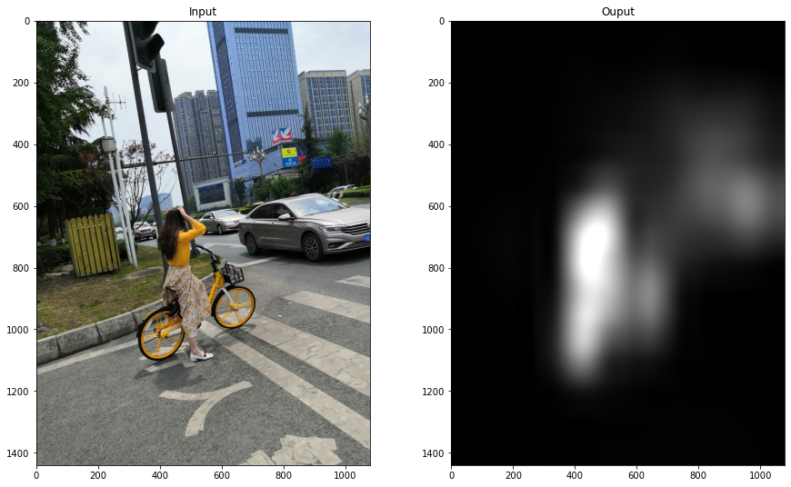

## SALICON



Customized implementation of the paper [SALICON: Reducing the Semantic Gap in Saliency Prediction by Adapting Deep Neural Networks](https://www.cv-foundation.org/openaccess/content_iccv_2015/papers/Huang_SALICON_Reducing_the_ICCV_2015_paper.pdf) by PyTorch for saliency prediction. This model was trained from scratch with Salicon Dataset which is available on http://salicon.net/download/.

### Usage

#### Dataset Preparing

Download Salicon dataset and create the saliency map by using fixation_train/val/test2014.json files. 

```shell
python create_dataset.py --salicon_dir=dataset_example --num_thread=6
```

The dataset examples can be found in directory ./dataset_example

#### Prediction

Get the checkpoint file from [here](https://drive.google.com/file/d/1YwDdvNOUH01MgfZCqszQV9xwWdV4gsrm/view?usp=sharing).

```shell
python test.py --images=/path/to/image_or_folder --checkpoint=/path/to/your/checkpoint_file --output=/folder/to/output_images
```

#### Train

```shell
python train.py --data_dir /opt/dataset/SALICON --checkpoints_dir ./checkpoints --batch_size 16 --nepochs 60
```

### Result

Saliency prediction examples are shown below


### TensorRT Optimization

See [Here](./tensorrt/README.md)