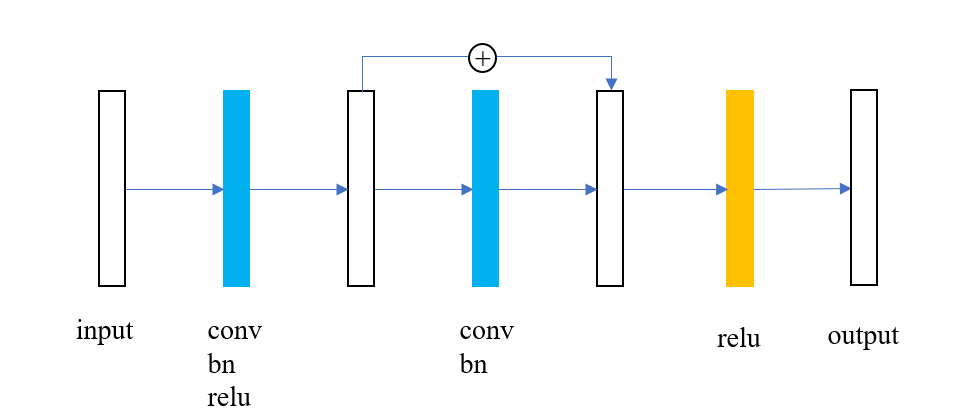
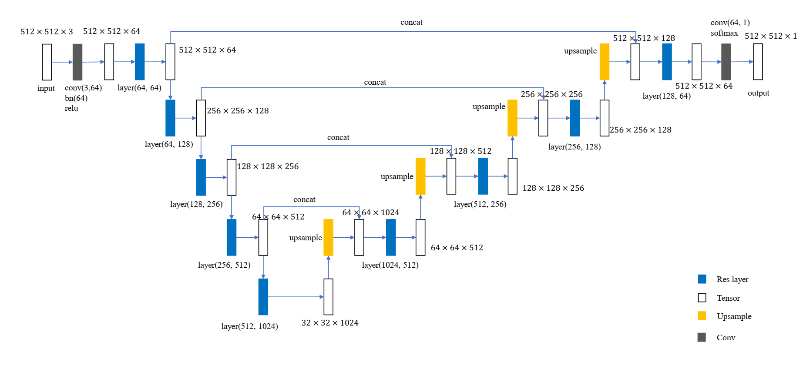

## Res-UNet: Saliency Prediction with PyTorch


Customized implementation of the UNet improved by residual block in PyTorch for saliency prediction. This model was trained from scratch with Salicon Dataset which is available on http://salicon.net/download/.

### Usage

#### Dataset Preparing

Download Salicon dataset and then generate the saliency map by using fixation_train/val/test2014.json files. See [utils.py](utils.py) for detail, and the dataset examples are shown in directory ./data_sample

#### Prediction

Get the checkpoint file from [here](https://drive.google.com/file/d/11HvDKazy74h6W0HrFfY1ldK_2Wjb5SAW/view?usp=sharing).

```shell
python test.py --images=/path/to/image_or_folder --checkpoint=/path/to/your/checkpoint_file --arch=res_unet --output=/folder/to/output_images
```

#### Train

```shell
python train.py --images_dir=/path/to/images_folder --fixations_dir=/path/to/label_folder --train_csv=/path/to/train_csv_file --arch=res_unet 
```

### Result

Saliency prediction examples are shown below


### UNet with residual block

#### Residual Block

The structure of residual block is the basic block described in ResNet paper which has two convolution layers and one shortcut connection to perform identity mapping. 



#### Res-UNet

Res-UNet is a neural network has the structure similar to UNet, the difference is that the convolutional downsample layers in the UNet are replaced by the residual layers which is constructed by two stacked residual blocks.



